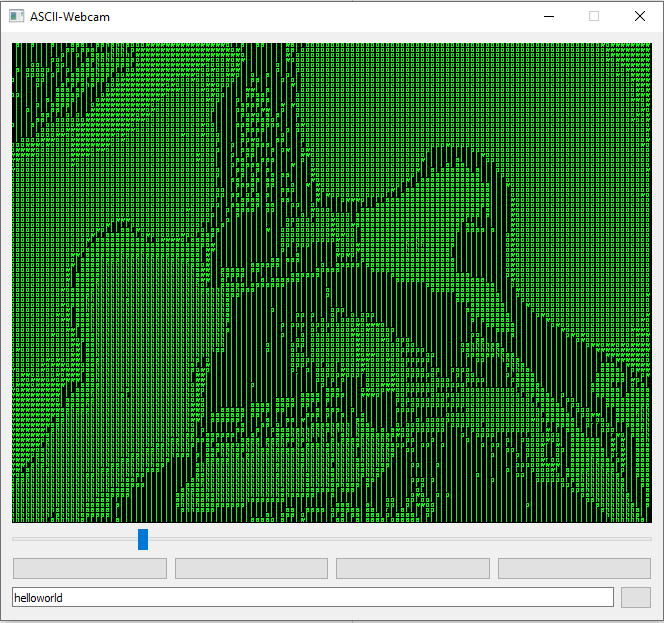

# ascii-webcam
Transform webcam frames to ascii art. A simple implementation with a GUI.  

## Usage
Use the Slider to change the size of displayed letters.  
Use the Buttons to switch between multiple display modes:  
  - single color
  - single color with brightness
  - color map (jet)
  - real color  

Use the line edit field to change the displayed letters. 
The letters used are displayed in terms of their order over the luminance on the image. 
